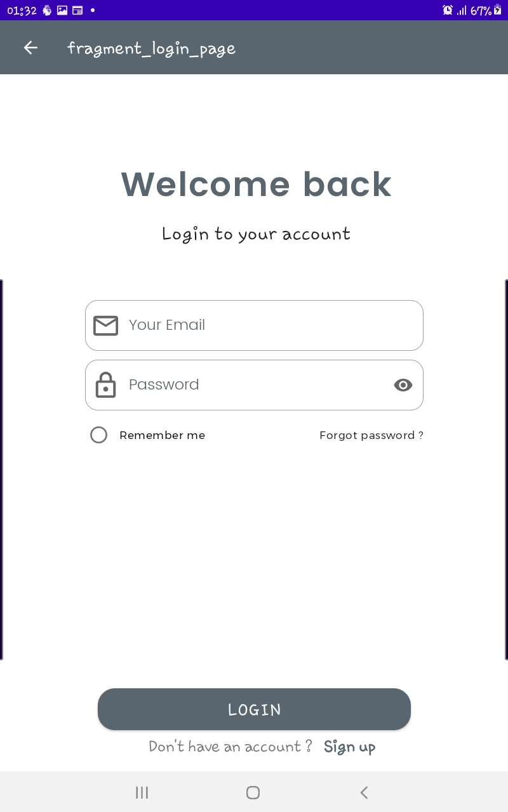

# Vorti
An idea a friend of mine gave me

## Description
- On launching the app, the boarding screen is shown which prompts the user to either sign up or login
- Depending on what you pick you are takeen to the respective page.
- I did not use firebase or any other authentication servive 
- However, I created a data class and another class to hold the values.
- The email and name texts must pass some requirements(email length, contains '@' and '.' sign, etc) before the app can authenticate it
- After authentication, the user is taken to another page where his/her information is displayed

## Note
**This personal project was done after completion of Unit 3: Navigation, Android Basics in Kotlin**
## Screenshots
**Onboarding Page**
--

**Login Page**
--

**Signin Page**
--

